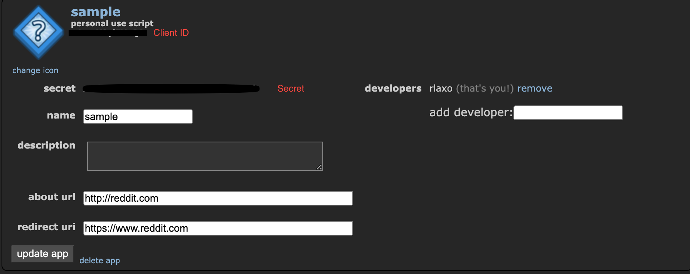

# Reddit Alert

Foobar is a Python library for dealing with word pluralization.

## Installation

Use the package manager [pip](https://pip.pypa.io/en/stable/) to install selenium.

Use the package manager [brew](https://brew.sh/) to install chromedriver
```bash
pip install selenium
brew install chromedriver
```

## Usage
Get your client id and client secret from [get client id and secret](https://www.reddit.com/prefs/apps)
1. Press on "create app" at the bottom of the page
2. Fill out information and select script

Add reddit client id, client secret, username, and password in env/env_variables.py

```python
import praw

reddit = praw.Reddit(
    client_id="YOUR CLIENT ID",
    client_secret="YOUR CLIENT SECRET",
    user_agent="ANYTHING CAN GO HERE",
    username="REDDIT USERNAME",
    password="REDDIT PASSWORD"
)
```


## Contributing
Pull requests are welcome. For major changes, please open an issue first to discuss what you would like to change.

Please make sure to update tests as appropriate.

## License
[MIT](https://choosealicense.com/licenses/mit/)